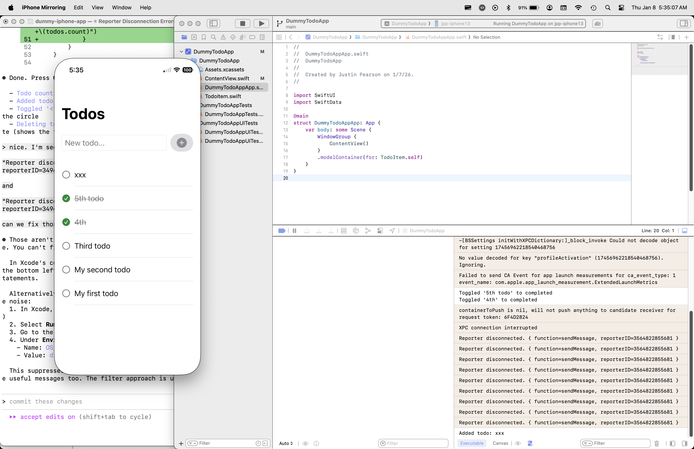
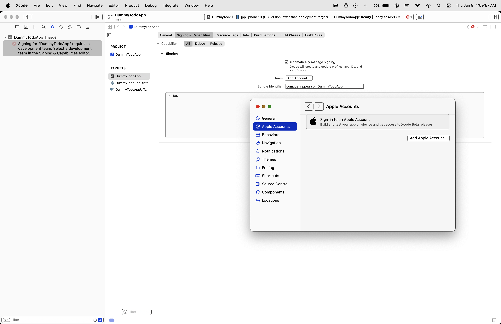
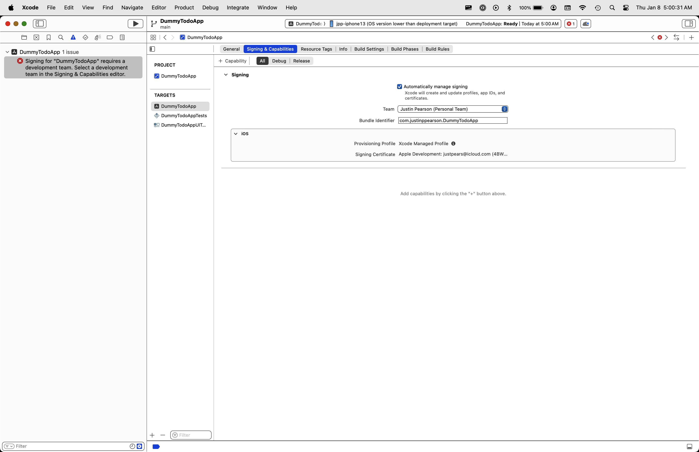
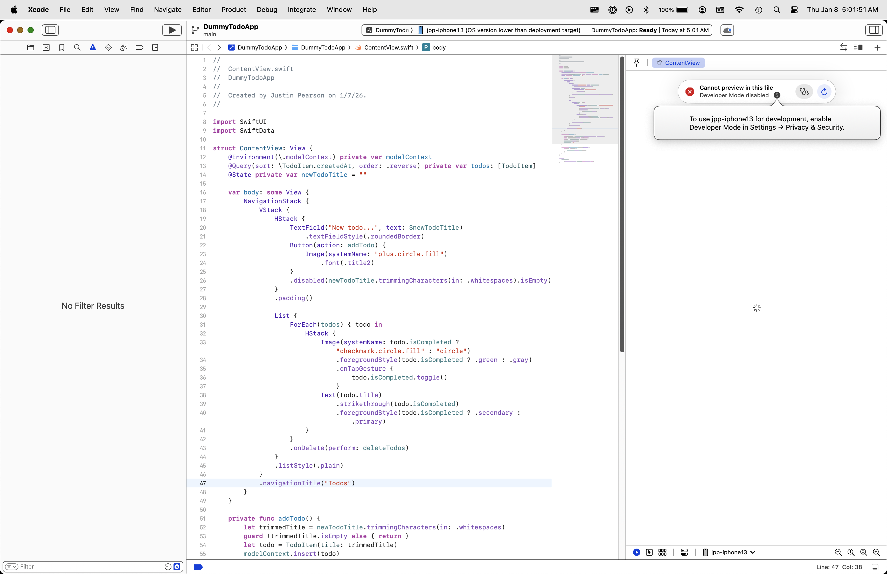
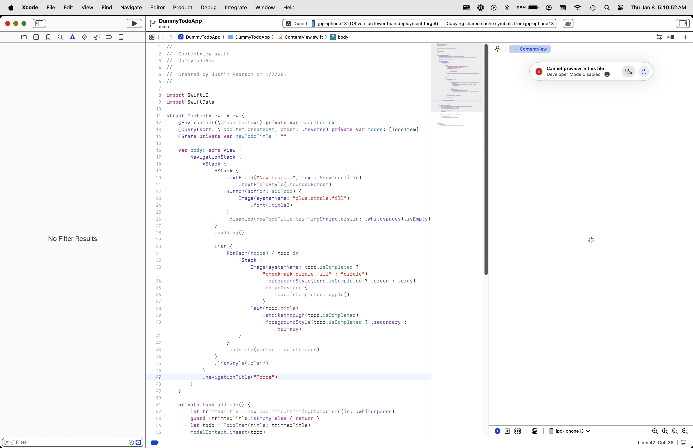
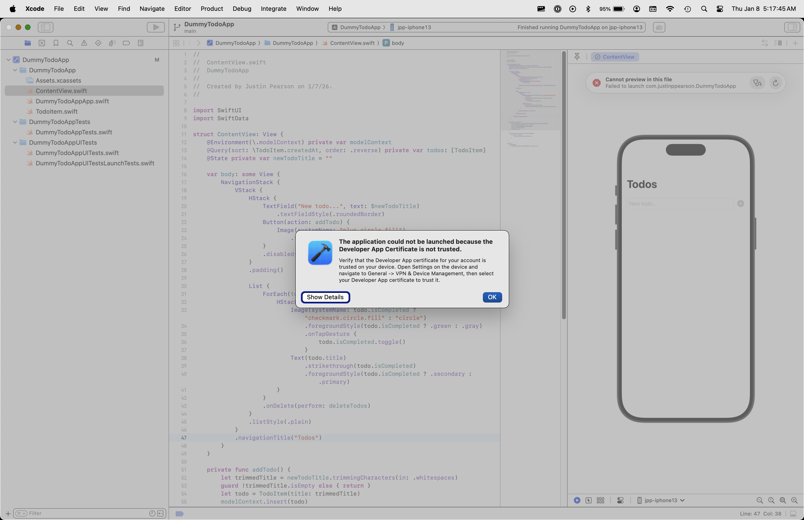

# DummyTodoApp

A simple iOS todo app built with SwiftUI and SwiftData. This is a learning project for iOS development.



## Features

- Add todos with a text field
- Mark todos as complete/incomplete (tap the circle)
- Delete todos (swipe left)
- Persistent storage using SwiftData

---

## Running the App on Your iPhone

### Prerequisites (One-Time Setup)

#### 1. Install Xcode (Mac)

Download Xcode from the Mac App Store. This is a large download (~12GB) and requires macOS.

#### 2. Clone the Project (Terminal)

```bash
git clone https://github.com/justinpearson/dummy-iphone-app.git
cd dummy-iphone-app
```

#### 3. Open the Project (Mac)

Double-click `DummyTodoApp/DummyTodoApp.xcodeproj` to open it in Xcode.

---

### Configure Signing (One-Time Setup in Xcode)

Before you can deploy to a physical iPhone, you need to configure code signing with your Apple ID.

#### 1. Select the Project

In Xcode's left sidebar (Navigator), click on **DummyTodoApp** (the blue icon at the very top of the file list).

#### 2. Select the Target

In the middle panel, under **TARGETS**, click **DummyTodoApp**.

#### 3. Open Signing & Capabilities

Click the **Signing & Capabilities** tab (in the row of tabs: General, Signing & Capabilities, Resource Tags, etc.).

#### 4. Add Your Apple Account

Click the **Team** dropdown. If you don't see your account:
1. Click **Add Account...**
2. In the dialog that opens, click **Add Apple Account...**
3. Sign in with your Apple ID (a free account works)



#### 5. Select Your Team

After signing in, select your team from the **Team** dropdown (it will show as "Your Name (Personal Team)").



---

### Enable Developer Mode (One-Time Setup on iPhone)

Your iPhone must have Developer Mode enabled to run apps from Xcode.

#### 1. Connect Your iPhone

Connect your iPhone to your Mac via USB cable. If prompted on your iPhone, tap **Trust** and enter your passcode.

#### 2. Select Your iPhone in Xcode

In Xcode's top toolbar, click the device dropdown (shows "Any iOS Device" or a simulator name) and select your iPhone.

#### 3. Attempt to Build

Press the **Play button** (▶) in the **upper-left corner** of Xcode, or press **Cmd+R**.

If Developer Mode is disabled, you'll see an error:



#### 4. Enable Developer Mode (iPhone)

On your **iPhone**:

1. Open **Settings**
2. Go to **Privacy & Security**
3. Scroll down and tap **Developer Mode**
4. Toggle it **ON**
5. Your iPhone will prompt you to restart — tap **Restart**
6. After restart, confirm enabling Developer Mode when prompted

> **Note:** The Developer Mode option only appears after you've connected your iPhone to Xcode at least once. If you don't see it, make sure your phone is connected and recognized by Xcode, then check again.

---

### First-Time Device Setup (One-Time)

The first time Xcode connects to your iPhone for development, it needs to copy debug symbols. This is automatic but takes time.

#### Wait for Symbol Copying

After enabling Developer Mode, Xcode will show "Copying shared cache symbols from [your iPhone]" in the status bar:



**This takes 5-15 minutes.** Just wait for it to complete. You only need to do this once per iOS version on your device.

---

### Trust the Developer Certificate (One-Time Setup on iPhone)

The first time you run an app from your free developer account, your iPhone won't trust it.

#### 1. Build and Run

In **Xcode**, press the **Play button** (▶) in the upper-left, or **Cmd+R**.

If you see this error:



#### 2. Trust Your Certificate (iPhone)

On your **iPhone**:

1. Open **Settings**
2. Go to **General** → **VPN & Device Management**
3. Under "Developer App", tap your Apple ID email
4. Tap **Trust "[your email]"**
5. Tap **Trust** again to confirm

#### 3. Run Again

Go back to **Xcode** and press **Play** (▶) or **Cmd+R** again. The app should now launch on your iPhone.

---

### Running the App (Every Time)

Once the one-time setup is complete, running the app is simple:

1. Connect your iPhone to your Mac (USB or Wi-Fi)
2. Open the project in Xcode
3. Select your iPhone from the device dropdown in the top toolbar
4. Press the **Play button** (▶) in the upper-left, or **Cmd+R**

The app will build, install, and launch on your iPhone.

#### Disconnecting

To disconnect:

1. In **Xcode**, press the **Stop button** (■) next to the Play button to end the debug session
2. Unplug your iPhone (no need to eject)

The app remains installed and works without Xcode.

---

### Important Limitations

#### Free Developer Account: 7-Day Expiration

Apps installed with a free Apple developer account expire after **7 days**. When the app expires:
- The app icon remains but won't launch
- Reconnect your iPhone to Xcode and press Play to reinstall
- Your data (todos) is preserved — only the app binary expires

A paid Apple Developer account ($99/year) removes this limitation.

#### iOS Version Compatibility

The app's deployment target is iOS 26.0. If your iPhone runs an older iOS version, you'll see "OS version lower than deployment target" in Xcode. To fix this:

1. In Xcode, select **DummyTodoApp** in the Navigator (left sidebar)
2. Select the **DummyTodoApp** target
3. Go to the **General** tab
4. Under **Minimum Deployments**, lower the iOS version to match your phone

---

## Uninstalling the App and Reverting iPhone Settings

### Remove the App (iPhone)

On your **iPhone**:

1. Find the **DummyTodoApp** icon on your Home Screen
2. Long-press the icon until the menu appears
3. Tap **Remove App** → **Delete App** → **Delete**

This also deletes all app data (your todos).

### Disable Developer Mode (iPhone)

If you no longer need to develop iOS apps, you can disable Developer Mode:

On your **iPhone**:

1. Open **Settings**
2. Go to **Privacy & Security**
3. Scroll down and tap **Developer Mode**
4. Toggle it **OFF**
5. Your iPhone will restart

> **Warning:** Disabling Developer Mode will remove all apps installed via Xcode (including this one).

### Remove Developer Certificate Trust (iPhone)

To remove the trust setting for your developer certificate:

On your **iPhone**:

1. Open **Settings**
2. Go to **General** → **VPN & Device Management**
3. Under "Developer App", tap your Apple ID email
4. Tap **Delete App** to remove the certificate trust (this also deletes apps signed with that certificate)

If there are no developer apps installed, this section won't appear.

---

## Development

### Build from Command Line

```bash
# Build the app
xcodebuild -project DummyTodoApp/DummyTodoApp.xcodeproj -scheme DummyTodoApp -configuration Debug build

# Run unit tests
xcodebuild -project DummyTodoApp/DummyTodoApp.xcodeproj -scheme DummyTodoApp \
  -destination 'platform=iOS Simulator,name=iPhone 17' test
```

### Debug Logging

The app includes `print()` statements that output to Xcode's debug console (bottom panel). You'll see messages when you:
- Add a todo
- Toggle a todo's completion status
- Delete a todo

### Project Structure

```
DummyTodoApp/
├── DummyTodoApp/           # Main app source
│   ├── Assets.xcassets/    # App icons, colors, images
│   ├── TodoItem.swift      # SwiftData model
│   ├── ContentView.swift   # Main UI
│   └── DummyTodoAppApp.swift
├── DummyTodoAppTests/      # Unit tests
└── DummyTodoAppUITests/    # UI tests
```
